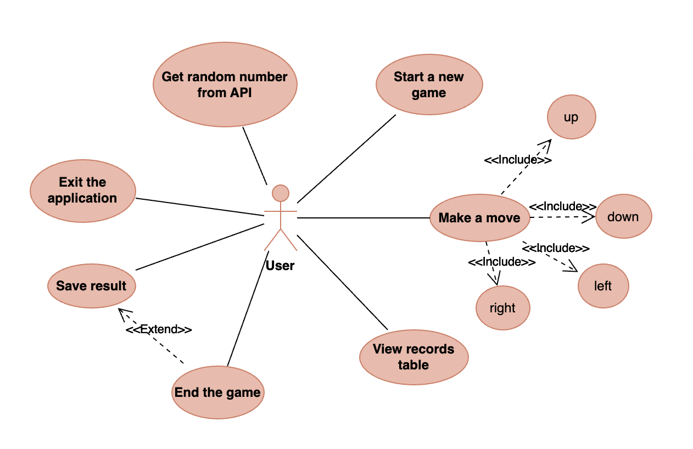

## Main Functional Requirements

### Application Navigation
- The application should have a main screen with buttons "Start Game", "Records", and "Exit".
- Users should be able to navigate between screens within the application.
- The application should handle the system "Back" button correctly.

### Gameplay
- The game should display a 4x4 grid game board.
- Initial tiles (usually two tiles with a value of 2 or 4) should be generated when the game starts.
- Users should be able to control the game using swipes in four directions (up, down, left, right).
- Users should have the option to control the game using on-screen direction buttons.
- When a move is made, all tiles should shift in the chosen direction until they can't move further.
- When two tiles with the same value collide, they should merge into one tile with the combined value.
- A new tile with a value of 2 or 4 should appear in a random free cell after each move.
- The game should display the current score of the user.
- The game should determine the end of the game when no more moves are possible.
- When a tile with the value of 2048 is reached, the game should congratulate the user but allow to continue playing.

### Integration with External API
- Each time the game starts, the application should request a random number from 1 to 100 from an external API.
- The received number should be displayed on the game screen.
- If the number is greater than 50, 10 points should be added to the current score.
- If the number is 50 or less, 5 points should be subtracted from the current score (but the score cannot become negative).

### Record System
- The application should store the top 10 best results in a local SQLite database.
- The records screen should display a table with the top 10 best results.
- The records table should include the score and the date of achievement.
- If the result at the end of the game is among the top 10, it should be saved in the database.
- Data loading from the database should occur in a separate thread.
- A loading indicator should be displayed during data loading.

### Performance and Multithreading
- Data loading from the database should be performed in a separate thread.
- Requests to the external API should be performed asynchronously.
- The application should display loading indicators during long operations.
- The user interface should not be blocked during background operations.

## User Stories

### As a new player

**I want to see a clear main screen** so that I can quickly start a game or view records.

_Acceptance Criteria:_
- The main screen contains large, clearly visible buttons.
- Buttons have clear labels: "Start Game", "Records", "Exit".
- The interface has an attractive design consistent with the game theme.

**I want to be able to quickly start a new game** so that I don't waste time on settings.

_Acceptance Criteria:_
- After pressing the "Start Game" button, the game starts immediately.
- The game board is automatically generated with initial tiles.
- The score starts at zero.

**I want to understand the rules of the game** so that I know how to play.

_Acceptance Criteria:_
- The game screen includes brief information about the rules or hints.
- The interface is intuitive and does not require additional explanations.

### As an experienced player

**I want to have convenient controls** so that I can play effectively.

_Acceptance Criteria:_
- The game responds to swipes in four directions.
- There are alternative control buttons for those who prefer them.
- The controls are responsive and without delays.

**I want to see my current score** to track my progress.

_Acceptance Criteria:_
- The score is displayed prominently on the game screen.
- The score updates in real time as tiles are combined.
- Information about the bonus/penalty from the random number is displayed.

**I want to know when the game is over** to understand my result.

_Acceptance Criteria:_
- When no more moves are possible, a message about the end of the game is displayed.
- The final score is shown.
- An option to start a new game is offered.

**I want to see the records table** to compare my results with previous ones.

_Acceptance Criteria:_
- The records table displays the top 10 results.
- Results are sorted by score in descending order.
- Each result shows the date it was achieved.
- A loading indicator is displayed during data loading.

**I want my high scores to be saved** to track my progress.

_Acceptance Criteria:_
- After the game ends, a high score is automatically saved in the records table.
- If the result is not in the top 10, the user receives a corresponding notification.
- Data is saved even after closing the application.

## Use Cases

### Scenario 1: Starting a New Game
1. The user opens the application.
2. The system displays the main screen with buttons "Start Game", "Records", and "Exit".
3. The user presses the "Start Game" button.
4. The system sends a request to the external API to get a random number.
5. The system displays a 4x4 game board with two initial tiles.
6. The system displays the received random number and applies the corresponding bonus/penalty to the score.
7. The user begins the game by making swipes or pressing direction buttons.

### Scenario 2: Making a Move in the Game
1. The user is on the game screen.
2. The user makes a swipe in one of the four directions (or presses the corresponding button).
3. The system shifts all tiles in the indicated direction.
4. The system merges tiles with the same values if they collide.
5. The system updates the score according to the merges made.
6. The system checks if there are free cells on the board.
7. If there are free cells, the system generates a new tile with a value of 2 or 4 at a random free cell.
8. The system checks if there are possible moves.
9. If there are no possible moves, the system declares the end of the game.

### Scenario 3: Ending the Game and Saving the Result
1. The system determines that there are no possible moves.
2. The system displays a message about the end of the game and the final score.
3. The system checks if the result is in the top 10.
4. If the result is in the top 10, the system saves it in the database.
5. The system offers the user to start a new game or return to the main screen.
6. The user selects one of the offered options.

### Scenario 4: Viewing the Records Table
1. The user is on the main screen.
2. The user presses the "Records" button.
3. The system displays a loading indicator.
4. The system starts a separate thread to load data from the database.
5. After loading the data, the system hides the loading indicator.
6. The system displays a table with the top 10 results, including the score and date.
7. The user views the records table.
8. The user presses the "Back" button to return to the main screen.

## Use Case Diagram

